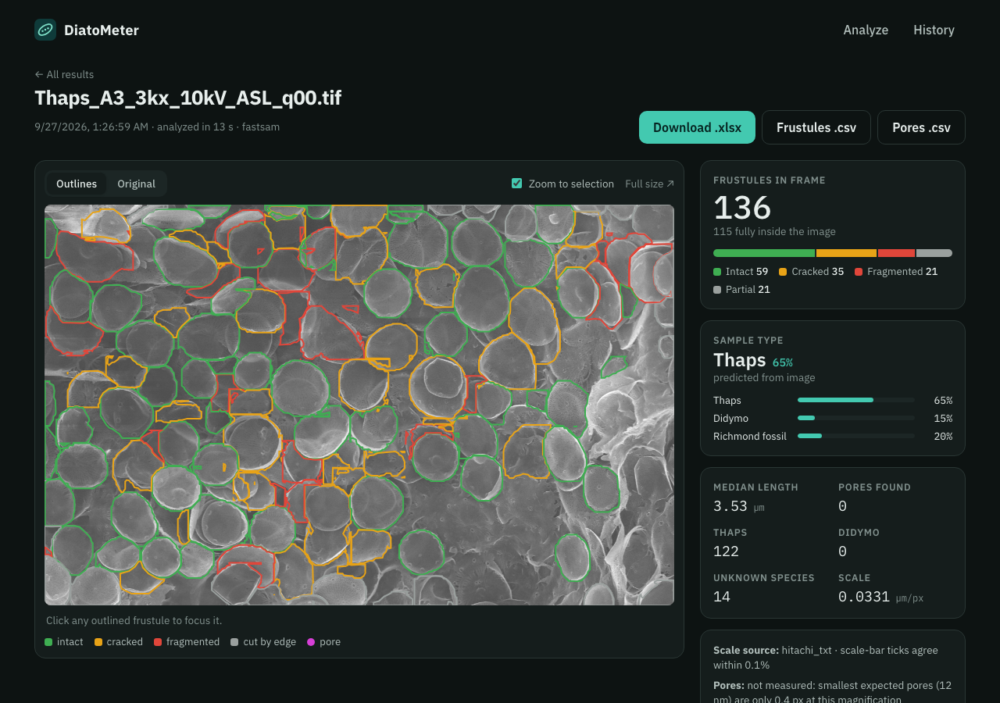
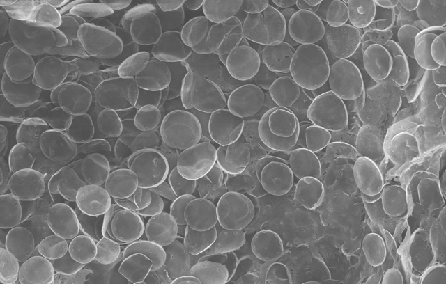
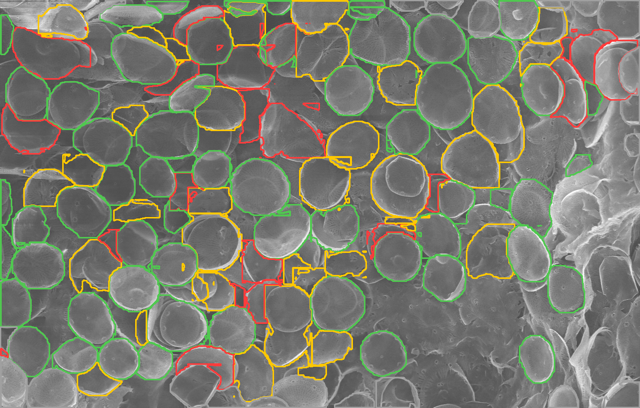
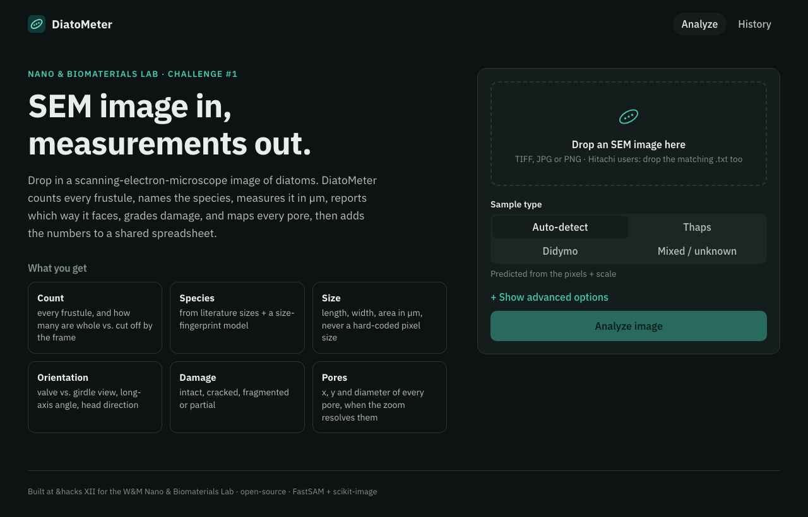
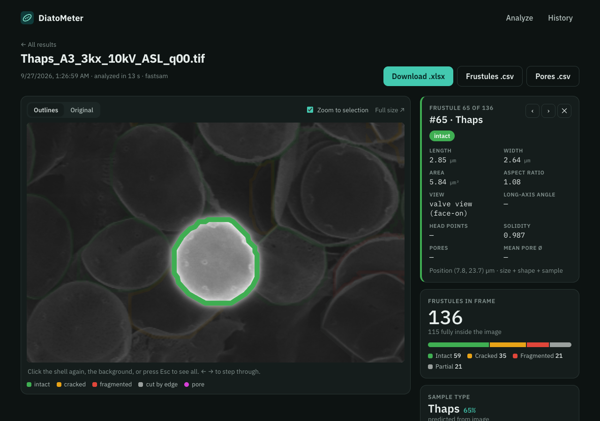
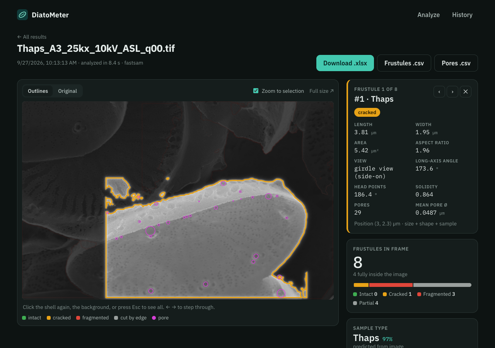
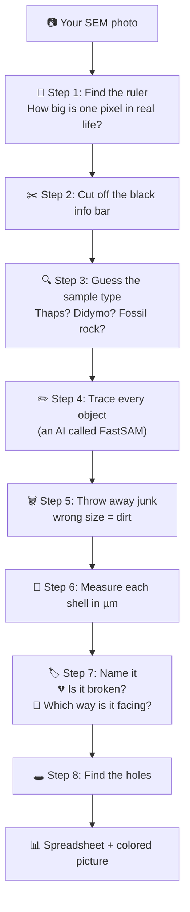
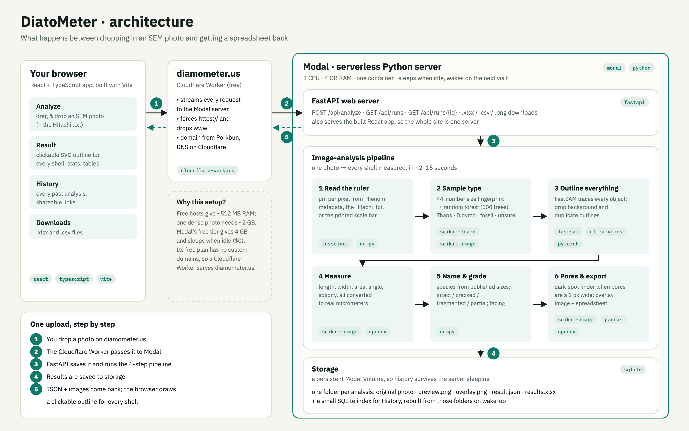
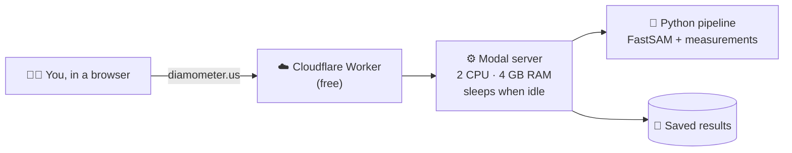

# 🔬 DiatoMeter

### Drop in a microscope photo of diatoms. Get every shell counted, named, measured, and checked for damage, in seconds.

**👉 Try it now: [diamometer.us](https://diamometer.us)** · Built in 24 hours at **&hacks XII** (William & Mary, Sept 26–27, 2026) for the **W&M Nano & Biomaterials Lab**, Challenge #1.



---

## 📖 Table of contents

1. [What is this? (the 30-second version)](#-what-is-this-the-30-second-version)
2. [Before → After](#-before--after)
3. [How to use it (3 steps)](#-how-to-use-it-3-steps)
4. [What the colors mean](#-what-the-colors-mean)
5. [How it works (explained simply)](#-how-it-works-explained-simply)
6. [How the website is built](#%EF%B8%8F-how-the-website-is-built)
7. [What's in the spreadsheet](#-whats-in-the-spreadsheet)
8. [How do we know it's right?](#-how-do-we-know-its-right)
9. [Honest limits](#%EF%B8%8F-honest-limits)
10. [Run it on your own computer](#-run-it-on-your-own-computer)
11. [For developers](#%EF%B8%8F-for-developers)
12. [Credits](#-credits)

---

## 🤔 What is this? (the 30-second version)

**Diatoms** 🦠 are tiny algae that build themselves **glass shells** (scientists call a shell a *frustule*). Each shell is covered in tiny holes (*pores*), in a pattern unique to its species. These shells are so small that about **20 of them fit across one human hair**.

Piles of old diatom shells (*diatomite*) are useful for filters, insulation and even medical materials. But to use them, scientists first need to **measure** them. Today that means a person with a microscope photo and a digital ruler, measuring **one shell at a time, by hand**. 😩

**DiatoMeter does that measuring for you:**

| The lab asked… | DiatoMeter answers |
| --- | --- |
| 🔢 How many shells are in the photo? | Counts every one, plus how many are fully inside the frame |
| 🏷️ What kind (species) are they? | *Thalassiosira* ("Thaps"), *Didymosphenia* ("Didymo"), or unknown |
| 📏 How big are they? | Length, width and area in **micrometers (µm)** |
| 🧭 Which way are they facing? | Face-up or on their side, plus the angle they point |
| 💔 Are they broken? | Intact, cracked, fragmented, or cut off by the photo's edge |
| 🕳️ How many holes, and how wide? | The position and size of every pore, when the photo is zoomed in enough |

All of it lands in a **spreadsheet** you can download. No coding needed. It's just a website.

---

## 📸 Before → After

<table>
  <tr>
    <th>What you upload 📷</th>
    <th>What DiatoMeter sees ✨</th>
  </tr>
  <tr>
    <td></td>
    <td></td>
  </tr>
  <tr>
    <td>A real SEM photo from the lab: hundreds of tiny shells.</td>
    <td><b>136 shells</b> found and outlined in about 15 seconds. Green = intact, orange = cracked, red = broken.</td>
  </tr>
</table>

---

## 🚀 How to use it (3 steps)

### Step 1: Drop in a photo
Go to **[diamometer.us](https://diamometer.us)** and drag your SEM image into the box. Using a **Hitachi** microscope? Drop the matching `.txt` file in at the same time (it tells the program how zoomed-in the photo is).



> 💡 Leave **Sample type** on **Auto-detect**. The program figures out the species by itself.

### Step 2: Look at the results
After a few seconds, you'll see every shell outlined, a count, the damage breakdown, and which species it thinks it is.


### Step 3: Click any shell to zoom in on it 🔍
Click a shell and **everything else fades away**. You get that shell's size, which way it's lying, and whether it's damaged. Use the **← →** arrow keys to step through shells, and **Esc** to go back.



On zoomed-in photos, the **pink circles are pores** (tiny holes in the glass) that belong to the shell you clicked:



Then click **Download .xlsx** to get everything as a spreadsheet. 🎉

Every photo you analyze is saved under **History**, so you can come back to it or share the link. The link even remembers which shell you clicked (for example `diamometer.us/runs/…?f=65`).

---

## 🎨 What the colors mean

| Color | Meaning |
| --- | --- |
| 🟩 **Green** | **Intact**: whole and healthy |
| 🟧 **Orange** | **Cracked**: full-sized, but its outline has a notch or dent |
| 🟥 **Red** | **Fragmented**: a broken piece, much smaller or very jagged |
| ⬜ **Gray** | **Partial**: cut off by the edge of the photo, so we can't see all of it |
| 🟣 **Pink circle** | A **pore** (a tiny hole in the glass) |

---

## 🧠 How it works (explained simply)

Think of DiatoMeter as a **very patient lab assistant with a ruler**. Here's what happens to your photo:



### 📏 Step 1: Find the ruler
A photo is made of tiny squares called **pixels**. To measure real sizes, we need to know how big one pixel is, like the "1 inch = 1 mile" on a map. DiatoMeter finds this **from the photo itself**, never by guessing:
- **Phenom microscope:** the answer is hidden inside the image file.
- **Hitachi microscope:** the little `.txt` file that comes with the photo says how zoomed-in it is.
- **No `.txt`?** It reads the ruler printed on the photo (like "10 µm"), measures how many pixels long that ruler is, and divides.
- **Still nothing?** It asks you to type it in, instead of guessing.

### ✂️ Step 2: Cut off the info bar
SEM photos have a black strip at the bottom with text and a ruler. We cut it off so the program doesn't think the letters are shells.

### 🔍 Step 3: Guess the sample type
Before looking at single shells, it looks at the **whole photo** and asks: *"What sizes of shapes is this photo full of?"* Thaps photos are packed with round blobs about 4 µm wide; Didymo photos have big shapes about 100 µm long. That "**size fingerprint**" goes to a small AI (a *random forest*, which works like **500 little judges voting**). If the judges can't agree, it honestly says **"unsure"**.

### ✏️ Step 4: Trace every object
**FastSAM** is an open-source AI that works like a kid tracing every shape in a coloring book 🖍️. It doesn't know what a diatom is. It just outlines *everything*: shells, broken bits, and dirt.

### 🗑️ Step 5: Throw away junk
Science books tell us how big each species is:
- **Thaps:** 2.5–15 µm across 🔵
- **Didymo:** 65–161 µm long 🥤 (shaped like an old Coke bottle)

Anything way too big or way too small for that sample is **dirt**, so we drop it.

### 📐 Step 6: Measure each shell
Using the ruler from Step 1, every outline becomes real numbers:
- **Length:** the longest distance across
- **Width:** the narrowest distance across
- **Area:** how much space it covers
- **Solidity:** compare the shape to a rubber band stretched around it. A smooth shape scores **1.0**, and a dent or bite scores lower.

### 🏷️ Step 7: Name it, check if it's broken, and see which way it's facing
- **Name:** small and round → Thaps. Long bottle shape → Didymo. Neither → unknown.
- **Broken?** Cut off by the edge → *partial*. Much too small or very jagged → *fragmented*. Has a notch → *cracked*. Otherwise → *intact* ✅
- **Facing:** a round Thaps shell seen as a circle is lying **face-up**; seen as a squashed drum, it's lying **on its side**.

### 🕳️ Step 8: Find the holes
First it asks: *"Are the holes even big enough to see in this photo?"* At low zoom, a Thaps pore is **smaller than one pixel**, so the program writes **"not measured"** instead of making up numbers. On close-ups, it looks for small dark round spots of the right size and records where each one is and how wide it is.

> 🎯 Only **two** steps use AI: the sample-type guess (Step 3) and the tracing (Step 4). Everything else is plain measuring and simple rules based on real science.

---

## 🏗️ How the website is built



In plain words: **your browser** shows the website, **Cloudflare** gives it the address diamometer.us, and a **Modal** server in the cloud does the heavy image work and keeps every result. (The diagram is generated by [`docs/architecture/make_diagram.py`](docs/architecture/make_diagram.py).)

---

## 📊 What's in the spreadsheet

Click **Download .xlsx** and you get one file with these tabs:

| Tab | One row per… | What's in it |
| --- | --- | --- |
| **image** | the photo | scale, sample type and confidence, counts, notes |
| **frustules** | shell | size, species, damage, facing, pores |
| **pores** | hole | which shell it's on, where it is, how wide |
| **summary** | species | a quick species × damage count table |
| **literature sizes** | species | the textbook sizes we compare against |

<details>
<summary><b>📖 Click here for what each column means</b></summary>

<br>

**frustules tab**

| Column | Plain-English meaning |
| --- | --- |
| `frustule_id` | The shell's number in this photo |
| `species` | Which species we think it is (or "unknown") |
| `length_um` / `width_um` | Longest / narrowest distance across, in micrometers |
| `area_um2` | How much space it covers, in square micrometers |
| `view` | Face-up (*valve view*) or on its side (*girdle view*) |
| `orientation_deg` | Which way its long side points (0° = sideways, 90° = up-down). Blank for round shells |
| `head_direction_deg` | For long shells: which way the wider end points |
| `damage` | intact, cracked, fragmented, or partial |
| `n_pores` | How many holes we found on it. **Blank = couldn't see, not zero** |
| `mean_pore_diameter_um` | Average hole width |
| `x_um`, `y_um` | Where the shell is in the photo |
| `aspect_ratio` | Length ÷ width (1 = round) |
| `solidity` | 1.0 = smooth outline; lower = dents or jagged edges |
| `touches_edge` | TRUE if the photo's border cuts it off |
| `species_reason` | Why we picked that species |
| `pore_note` | Why pores were or weren't measured |

**pores tab:** `frustule_id` (which shell), `x_um`, `y_um` (where), `diameter_um` (how wide).

**image tab:** `um_per_px` (the ruler), `scale_source` (where the ruler came from), `sample_type` + `sample_type_confidence`, and the counts.

</details>

---

## ✅ How do we know it's right?

| Check | Result |
| --- | --- |
| 📏 Our Thaps shells vs. the science books | We measure a median of **3.53 µm**; published size for lab-grown Thaps is **3.5–3.9 µm** ✅ |
| 📐 Our ruler reading vs. the microscope's own calibration | Matches within **0.12%** on all 13 Hitachi photos ✅ |
| 🔍 Sample-type guess on photo batches it never saw | **77%** right overall, **86%** right when it's confident (it says "unsure" otherwise). For comparison: always guessing the most common type scores 47%, and a model that only knows the zoom level scores 59%, so it's really looking at the shells. |
| ⏱️ Speed | About **2–15 seconds** per photo |

---

## ⚠️ Honest limits

We'd rather tell you than have you find out:

- **Damage grading is a first guess.** The cutoffs for "cracked" vs. "fragmented" haven't been checked against expert labels yet. Didymo's bottle shape has natural curves that the program sometimes reads as damage, so **Didymo gets marked broken too often**.
- **Touching shells sometimes merge** into one outline.
- **Pores are only measured on zoomed-in photos.** At low zoom they're smaller than a pixel.
- **Only two species are named** (Thaps and Didymo), because those are what the lab's photos contain. Everything else is "unknown."

---

## 💻 Run it on your own computer

Everything is free and open-source and runs on a normal laptop (no graphics card needed).

**You'll need:** [Python](https://www.python.org/downloads/) 3.10 or newer, [Node.js](https://nodejs.org/) 20 or newer, and [Git](https://git-scm.com/downloads).

**1. Download the project**
```bash
git clone https://github.com/sirElvinn/diatometer.git
cd diatometer
```

**2. Set up Python** (this installs PyTorch, so it takes a few minutes ☕)
```bash
python3 -m venv .venv
source .venv/bin/activate
pip install -r backend/requirements.txt
```
On Windows, use `.venv\Scripts\activate` instead of the `source` line.

**3. Build the website**
```bash
cd frontend && npm install && npm run build && cd ..
```

**4. Start it**
```bash
uvicorn app:app --app-dir backend --port 8000
```

**5. Open [http://localhost:8000](http://localhost:8000)** 🎉

The first analysis downloads the FastSAM model (23 MB) automatically.

> 💡 **Optional:** install [Tesseract](https://tesseract-ocr.github.io/tessdoc/Installation.html) (`brew install tesseract` on Mac) so it can read the printed ruler on photos that have no scale file.

---

## 🛠️ For developers

<details>
<summary><b>🗂️ What's in this folder</b></summary>

<br>

```
diatometer/
├── backend/
│   ├── app.py              ← the web server (FastAPI): upload, results, downloads
│   ├── storage.py          ← saves each analysis in its own folder + a small index
│   ├── sheets.py           ← optional: copies results to a Google Sheet
│   ├── requirements.txt    ← Python packages
│   └── pipeline/           ← 🧠 the image analysis
│       ├── scale.py        ← Step 1: find the ruler (µm per pixel)
│       ├── sample_type.py  ← Step 3: size fingerprint + random forest
│       ├── segment.py      ← Step 4: FastSAM tracing + duplicate removal
│       ├── measure.py      ← Steps 6–7: size, species, damage, facing
│       ├── species.py      ← the textbook sizes of each species
│       ├── pores.py        ← Step 8: find the holes
│       └── run.py          ← runs all the steps on a photo (or a whole folder)
├── frontend/               ← 🖥️ the website (React + TypeScript + Vite)
│   └── src/
│       ├── pages/          ← Analyze, Result, History pages
│       └── components/     ← the clickable image viewer and tables
├── proxy/                  ← ☁️ Cloudflare Worker that serves diamometer.us
├── modal_app.py            ← 🚀 how it's hosted on Modal
├── Dockerfile              ← run it anywhere with Docker
└── docs/images/            ← screenshots for this README
```

</details>

<details>
<summary><b>📁 Analyze a whole folder at once (no website)</b></summary>

<br>

```bash
python backend/pipeline/run.py --root "path/to/your/photos" --out results
```

This writes `results/results.xlsx` (every photo, every shell, every pore) and `results/overlays/` (the colored pictures). Useful options: `--match Thaps` (only files whose name contains "Thaps"), `--sample-type thaps|didymo|mixed|auto`, and `--backend circles` (a fast, no-AI circle finder for round shells).

To re-check the sample-type model's score: `python backend/pipeline/sample_type.py evaluate --root "path/to/photos"`

</details>

<details>
<summary><b>☁️ How it's hosted (free)</b></summary>

<br>



- **Modal** runs the app for free ($30 of compute a month, no card). It **sleeps when nobody's using it**, and the first visit after a quiet spell takes a few seconds to wake it. Results are kept in a Modal Volume.
- Modal's free plan has no custom domains, so a tiny **Cloudflare Worker** (`proxy/`) passes every request for `diamometer.us` to Modal, and redirects `http://` and `www.` to `https://diamometer.us`.

Deploy the app:
```bash
pip install modal
modal setup                                  # once: log in through the browser
cd frontend && npm run build && cd ..
modal deploy modal_app.py
```

Deploy the domain proxy (once the domain uses Cloudflare's nameservers):
```bash
cd proxy && npm install && npx wrangler deploy
```

The `Dockerfile` runs the same app on any host with **at least 4 GB of RAM** (a dense photo peaks around 2.1 GB).

</details>

<details>
<summary><b>📗 Optional: copy every result into a Google Sheet</b></summary>

<br>

The code for this is built in (`backend/sheets.py`), but **it isn't switched on for the live site yet**. To turn it on:

1. In [Google Cloud Console](https://console.cloud.google.com/), create a project and enable the **Google Sheets API**.
2. Under **IAM & Admin → Service accounts**, create a service account, then **Keys → Add key → JSON**.
3. Create a Google Sheet, **Share** it with the service account's email as **Editor**, and set **General access** to **Anyone with the link → Viewer**.
4. Copy the sheet ID from its URL (`https://docs.google.com/spreadsheets/d/<THIS PART>/edit`).
5. Locally: put these in a `.env` file (never commit it) and start with `--env-file .env`:
   ```
   GOOGLE_SHEET_ID=your-sheet-id
   GOOGLE_SERVICE_ACCOUNT_JSON=/absolute/path/to/key.json
   PUBLIC_URL=http://localhost:8000
   ```
   On Modal: create a secret named `diatometer-sheets` with the same three values and deploy with `WITH_SHEETS=1 modal deploy modal_app.py`.

The app then adds `images`, `frustules` and `pores` tabs and shows a **Public sheet ↗** link.

</details>

<details>
<summary><b>🔌 API</b></summary>

<br>

| Method | Path | What it does |
| --- | --- | --- |
| POST | `/api/analyze` | Upload a photo. Form fields: `image`, optional `sidecar` (.txt), `sample_type` (auto/thaps/didymo/mixed), `backend` (fastsam/circles), `um_per_px` |
| GET | `/api/runs` | History, newest first |
| GET | `/api/runs/{id}` | One result: photo summary, shells, pores, outlines |
| GET | `/api/runs/{id}/{file}` | `overlay.png`, `preview.png`, `results.xlsx`, `frustules.csv`, `pores.csv` |
| GET | `/api/runs.xlsx` | Every result so far in one spreadsheet |
| GET | `/api/config` | Google Sheet link (if configured) |

</details>

---

## 🙌 Credits

- Built in 24 hours at **&hacks XII** at William & Mary University, with help from an AI coding assistant ([Claude Code](https://claude.com/claude-code)).
- SEM images and the challenge come from the **W&M Nano & Biomaterials Lab**, which also suggested the key idea: *use the relative sizes of the organisms*.
- Outlining by [FastSAM](https://github.com/CASIA-IVA-Lab/FastSAM) through [Ultralytics](https://github.com/ultralytics/ultralytics). Measurements with [scikit-image](https://scikit-image.org/), [scikit-learn](https://scikit-learn.org/), [OpenCV](https://opencv.org/) and [Tesseract](https://github.com/tesseract-ocr/tesseract).
- Species sizes from the literature: *Thalassiosira pseudonana*, Poulsen et al. 2023 (*J. Phycology*) and the USGS NAS species profile; *Didymosphenia geminata*, [diatoms.org](https://diatoms.org) and Patrick & Reimer (1975).

**Built with:** Python · FastAPI · PyTorch · FastSAM · scikit-image · scikit-learn · OpenCV · React · TypeScript · Vite · Modal · Cloudflare Workers
